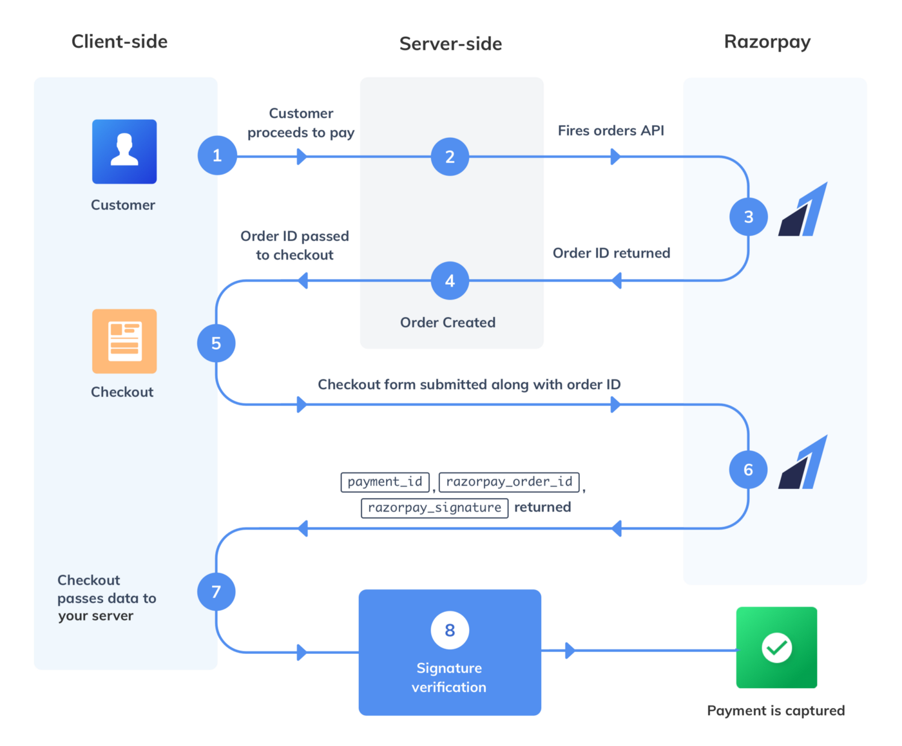

# Integration-RazorPay
Payment Gateway Razorpay 

## Built 
The app is constructed using Reactjs in client side, Nodejs Restapi in server side. Axios calls Mongodb for holding successfull transactions records and Razorpay as main source

## Working

## Contributing

[CONTRIBUTING.md](/CONTRIBUTING.md)

## License

This project is licensed under the MIT License - see the [LICENSE.md] file for details
